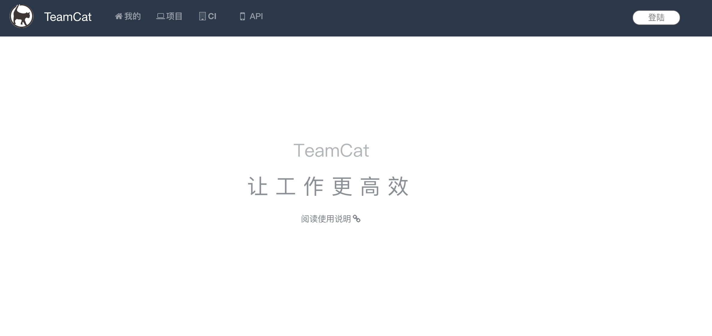
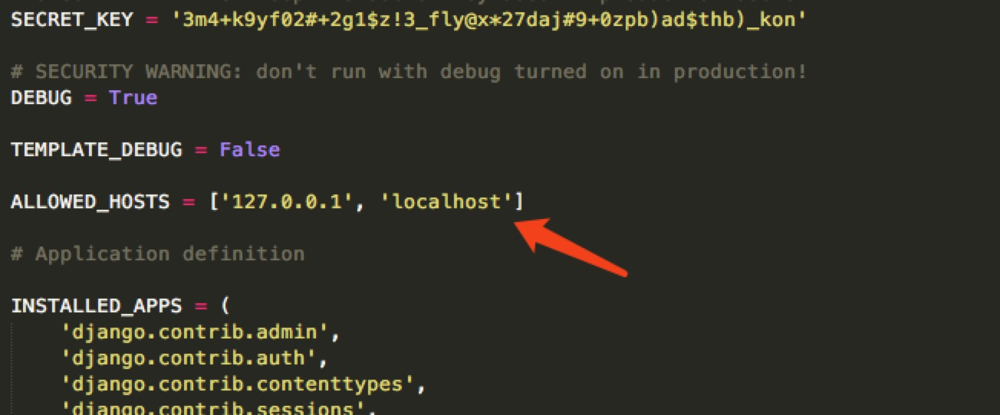
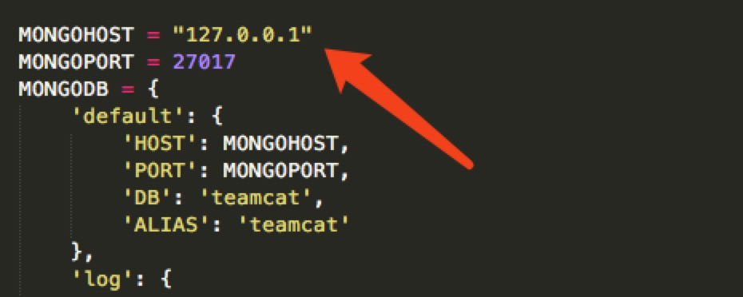
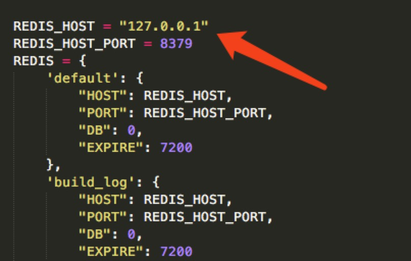
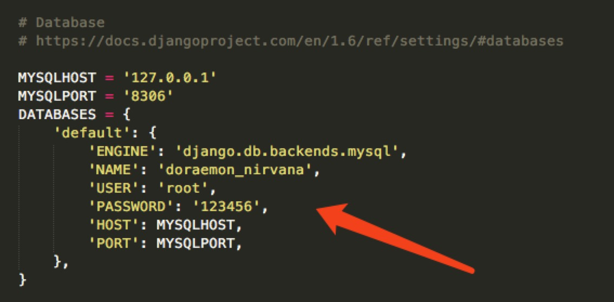
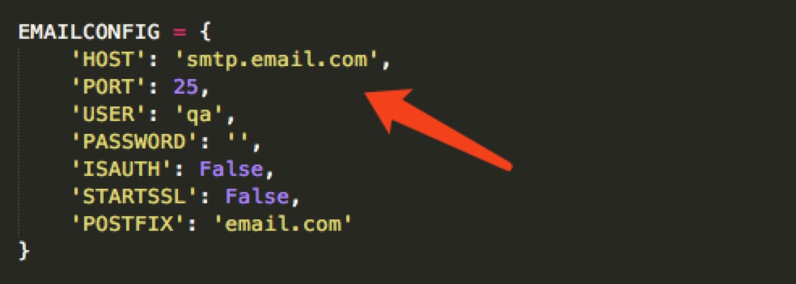
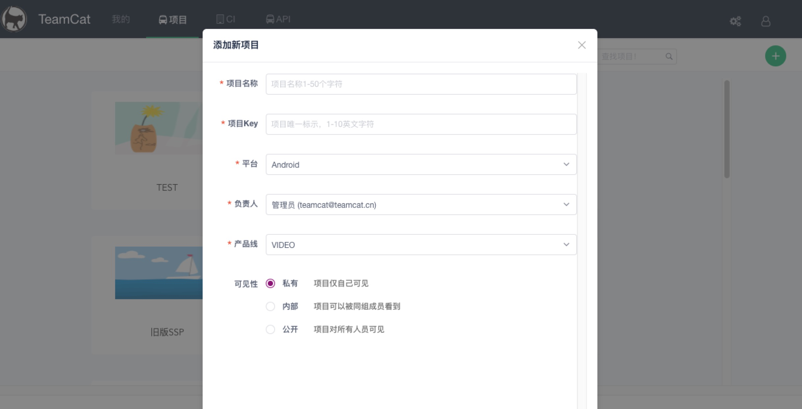
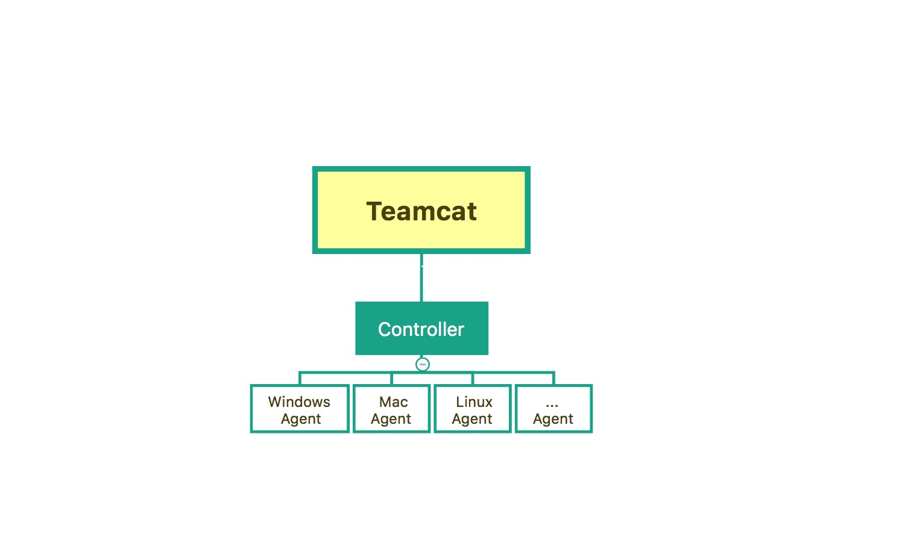

# TeamCat: 高效的软件项目管理，协作工具

Teamcat的项目管理包含了任务、提测、Bug管理，统计分析等功能。支持多成员协作，并且深度集成了持续集成（CI）。Teamcat 支持每日构建，自动化测试，一键部署等功能。 Teamcat 通过任务流功能支持流水线构建发布，正真做到高效的软件过程管理与监控。
Demo展示地址：[www.teamcat.cn](http://www.teamcat.cn)




## Installation

TeamCat安装部署部分在distribute文件夹中，分为组件分步部署与docker一键部署两种方式：

### 分步部署：
#### 要求：CentOs7  python3.5
#### TeamCat组件依赖：
mongo,redis,nginx,mysql,python
在build_shell文件夹下面已提供各个组件的安装脚本，注：nginx与python3.5必须安装脚本安装，其他供参考。
#### python安装要求：
需py3.5版本，用ditribute/0.0.1/python/python.sh脚本安装。
#### mongo安装要求：
需3.4版本以上，不能添加密码，安装后能够启动成功。
#### redis安装要求：
需3.2版本以上，安装后能够启动成功。
#### nginx安装要求：
需1.12.0版本以上，因涉及到nginx.conf文件配置，必须用ditribute/0.0.1/build_shell/nginx/nginx.sh脚本安装。
#### mysql安装要求：
需5.6，5.7版本，安装后能能够启动成功，确保能够登录。
将ditribute/0.0.1/build_shell/mysql 下面的doraemon_nirvana.sql与privileges.sql导入到mysql。

#### Teamcat 启动
首先在机器上创建/web/www 目录，将ditribute/0.0.1/build_shell下面的 teamcat与dist 拷贝到/web/www/下面。
打开/web/www/teamcat/doraemon/settings.py，修改配置文件。

将部署的机器地址添加到allow_host，如图所示

将安装的mongo信息添加到mongo配置，如图所示

将安装的redis信息添加到redis配置，如图所示

将安装的mysql信息添加到mysql配置，如图所示

将邮件服务器信息添加到email配置，如图所示


将teamcat.sh脚本加上执行权限，root权限下执行
   执行teamcat.sh
   
   ```sh
   $ ./teamcat.sh
   ```

### docker一键部署

前提：需要目标机器安装docker环境，并且系统要求在docker_V1.8,CentOS_7以上
1. 将distribute文件夹拷贝到要部署的目标机器
2. 进入到distribute/0.0.1/one_step_build_docker/文件夹中,执行如下命令：
 
   ```sh
   $ docker-compose build
   $ docker-compose up
   ```
#### 根据目前已使用人员的反馈，推荐大家使用docker安装，因shell部署是按照在一个全新机器上安装部署来写的，可能对原有机器各种组件的版本有影响，进而影响原有服务。而docker安装只要将docker安装成功，能够实现真正的一键部署。若docker安装因版本等问题报错，可选择按组件来分步安装。

## Quick Start

   安装成功后，输入目标机器地址，端口8848，例如http://127.0.0.1:8848/ 访问teamcat
   
### 注：目前teamcat只支持chrome浏览器，初始登录账号：teamcat@teamcat.cn 密码：123456  用此账号登录后可自由添加账号。

### 项目
1. 添加首个自己的项目

2. 进入到项目就可以使用问题，提测，任务，统计，归档等功能。
### CI:
   CI部分功能使用需要部署Controller与Agent，Controller具有监听、调度、下发任务等功能，Agent负责在所需的不同机器上执行具体构建任务，简要架构如下：

1. 部署步骤：
   将distribute/0.0.1/目录下将agent与conroller的zip包拷贝到目标机器，修改properties文件，将url配置为已成功部署teamcat的url地址。Linux，Mac机器运行.sh文件启动，windows机器运行.bat文件启动。
2. 使用步骤：
   首先进入CI-设置，添加一个Agent。添加一个CI任务，设置好任务配置及构建参数即可实现每日构建，自动化测试，一键部署等功能。并且支持任务流创建，通过任务流功能支持流水线构建发布。

## Q&A
### Question:
如果我想部署的目标机器已经存在mongo,redis,nginx,mysql等基础组件，不想重新安装这些可以直接启动TeamCat服务吗？

### Answer:
当然可以啦，但是首先目标机器需要创建/web/www/目录，并将distribute文件夹下的teamcat文件夹拷贝到此目录，打开teamcat/doraemon/settings.py文件，将其中的ALLOWED_HOSTS，MYSQLHOST，MONGOHOST，REDIS_HOST分别配置成已有环境的地址，并且EMAILCONFIG中的邮件服务器必须具有发邮件的权限才能正常发送构建通知邮件。如果不想创建此目录，需将settings.py文件中所有配置为/web/www/目录的地方改成teamcat实际所在目录的地址。

## More

如果大家有更多的问题或改进想法，欢迎访问我们的demo地址[www.teamcat.cn](http://www.teamcat.cn)，通过里面的联系方式与我们多多沟通交流。

